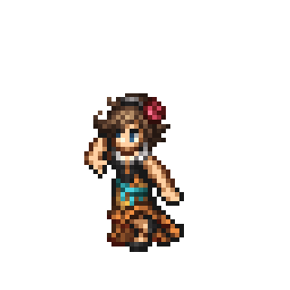
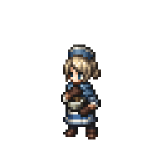

<h1 align="center">Hi 👋, I'm Diego Amorin</h1>
<h3 align="center">Desarrollador Full Stack</h3>

---

| 🌱 I’m currently learning **Data Science and Machine Learning** 💬 Ask me about **React, Python** 📫 How to reach me **amorinoficial33@gmail.com** ⚡ Fun fact: **Hago cosplay por las noches** |   |
| --- | --- |

---

| 🌱 I’m currently learning **Data Science and Machine Learning** 💬 Ask me about **React, Python** 📫 How to reach me **amorinoficial33@gmail.com** ⚡ Fun fact: **Hago cosplay por las noches** |   |
| --- | --- |

---

<h3 align="left">Languages and Tools:</h3>

 
 
 
 
 
 
 
 
 
 
 
 
 
 

---

<h3 align="left">🎮 Future:</h3>

In the future, I would love to create or participate in the creation of <b>video games</b>, whether by programming mechanics or contributing to the visual design.

